# Daim

A Bioconductor package for analysis of DamID-seq data

[](https://travis-ci.com/jma1991/Daim)


## Table of Contents

  * [Introduction](#introduction)
  * [Quick Start](#quick-start)
  * [Requirements](#requirements)
  * [Installation](#installation)
  * [Usage](#usage)
  * [Contributing](#contributing)
  * [Support and Migration](#support-and-migration)
  * [News](#news)
  * [Thanks](#thanks)
  * [Citation](#citation)
  * [References](#references)
  * [License](#license)

## Introduction

### DamID-seq

DNA adenine methyltransferase identification with sequencing (DamID-seq) is used to identify DNA binding sites for transcription factors and other chromatin proteins. It involves expression of a fusion protein (Dam-POI) consisting of DNA adenine methyltransferase (Dam) and the chromatin protein of interest (POI) being studied. The Dam-POI is targeted to the binding sites of the POI and nearby GATC sites are methylated by Dam in the DNA sequence. The methylated DNA is then isolated, amplified by selective PCR, and sequenced. Because Dam itself is a DNA binding protein, a control sample expressing only Dam is also prepared to correct for non-specific background methylation. The sequences from the Dam-POI and Dam samples are aligned back to the genome and differentially digested GATC restriction fragments are determined. Below is a simplified diagram of the experimental protocol from Illumina:


### Daim

The Daim software package incorporates methods for pre-processing, normalisation, and peak calling of DamID-seq data. It can be used to assess sample quality and reproducibility, identify both DNA binding and accessibility sites, and run downstream analyses such as peak annotation and motif analysis. The software is built upon the Bioconductor framework and leverages existing statistical packages to identify differentially digested GATC restriction fragments. Daim is implemented in R and is freely available as an open-source project.

## Quick Start

```r
# Attach required packages
> library("Daim")
> library("BSgenome.Mmusculus.UCSC.mm10")

# List alignment files
> bamPath <- c("Dam1.bam", "Dam2.bam", "Fusion1.bam", "Fusion2.bam")

# Specify Dam and Dam-fusion samples
> groupFactor <- factor(c(0, 0, 1, 1), levels = c(0, 1))

# Create restriction fragments
> resFrag <- digestGenome(BSgenome.Mmusculus.UCSC.mm10)

# Count reads into restriction fragments
> rawData <- fragmentCounts(bamPath, resFrag)

# Remove restriction fragment bias
> normData <- normalizeBias(rawData, groupFactor)

# Call DNA binding sites
> bindSite <- callPeaks(normData, alpha = 0.05, lfc = log2(1.5))

# Compute background methylation
> inputData <- computeInput(normData)

# Call DNA accessibility sites
> openSite <- callPeaks(inputData, alpha = 0.05, lfc = log2(1.5))
```

## Requirements

Daim requires the following Bioconductor packages to run:

  * [Biostrings][Biostrings]
  * [cqn][cqn]
  * [csaw][csaw]
  * [IHW][IHW]
  * [limma][limma]
  * [qsmooth][qsmooth]
  * [Rsubread][Rsubread]
  * [SummarizedExperiment][SummarizedExperiment]

[Biostrings]: https://bioconductor.org/packages/release/bioc/html/Biostrings.html
[cqn]: https://bioconductor.org/packages/release/bioc/html/cqn.html
[csaw]: https://bioconductor.org/packages/release/bioc/html/csaw.html
[IHW]: https://bioconductor.org/packages/release/bioc/html/IHW.html
[limma]: https://www.bioconductor.org/packages/release/bioc/html/limma.html
[qsmooth]: https://github.com/stephaniehicks/qsmooth
[Rsubread]: https://www.bioconductor.org/packages/release/bioc/html/Rsubread.html
[SummarizedExperiment]: https://www.bioconductor.org/packages/release/bioc/html/SummarizedExperiment.html

## Installation

The latest version of Daim and its dependencies can be installed using devtools:

```r
# Install Daim package
> library("devtools")
> install_github("jma1991/Daim")
```
The Daim package can then be loaded into R for usage:

```r
# Attach Daim package
> library("Daim")
```

## Usage

### Input data

Daim requires two types of input data:

1. Sequence alignment data (BAM format)
2. Reference genome sequence (BSgenome, DNAStringSet, or FASTA format)

Importantly, the Dam and Dam-fusion samples must be replicated in order to estimate variance for the analysis of differential methylation. The genome sequence used for read mapping must also be the same one provided to Daim for generating the restriction fragment annotation.

### Read mapping

The first stage in the analysis of DamID-seq data is to align the seqeuncing reads to the reference genome. There are many short read aligners available, most of which will work perfectly fine with DamID-seq data. Below is an example of using BWA and Samtools to align reads in FASTQ format and produce sequence alignment data in BAM format:

```bash
# Index reference genome
$ bwa index genome.fasta

# Align sequencing reads
$ bwa aln genome.fasta reads.fastq > reads.sai

# Convert to SAM format
$ bwa samse genome.fasta reads.sai reads.fastq > reads.sam

# Convert to BAM format
$ samtools view -b reads.sam > reads.bam

# Index aligned reads
$ samtools index reads.bam
```

### Fragment quantification

In order to quantify restriction fragment abundance, an annotation table of all possible GATC restriction fragments within the reference genome is required. The *digestGenome* function is used to extract restriction fragments from a BSgenome, DNAStringSet, or FaFile object:

```r
# Attach required packages
> library("Daim")
> library("BSgenome.Mmusculus.UCSC.mm10")

# Extract restriction fragments
> resFrag <- digestGenome(BSgenome.Mmusculus.UCSC.mm10)
```

The restriction fragments are represented as genomic ranges using the GRanges class. The object also contains two metadata columns which contain the length and GC content of each restriction fragment:

```r
# Container for restriction fragments
> resFrag
GRanges object with 6669641 ranges and 2 metadata columns:
            seqnames            ranges strand | digestBySize         digestByProb
               <Rle>         <IRanges>  <Rle> |    <integer>            <numeric>
        [1]     chr1         1-3000192      * |      3000192 2.36651520969325e-05
        [2]     chr1   3000193-3000814      * |          622    0.353697749196141
        [3]     chr1   3000815-3001049      * |          235    0.348936170212766
        [4]     chr1   3001050-3001120      * |           71    0.422535211267606
        [5]     chr1   3001121-3001796      * |          676    0.371301775147929
        ...      ...               ...    ... .          ...                  ...
  [6669637]     chrY 90843572-90844088      * |          517    0.481624758220503
  [6669638]     chrY 90844089-90844335      * |          247    0.368421052631579
  [6669639]     chrY 90844336-90844497      * |          162    0.493827160493827
  [6669640]     chrY 90844498-90844696      * |          199    0.376884422110553
  [6669641]     chrY 90844697-91744698      * |       900002  1.1111086419808e-06
  -------
  seqinfo: 21 sequences from mm10 genome
```

Restriction fragment abundance is quantified by counting the number of reads mapped to each restriction fragment sequence. The mapped reads are assigned to a single restriction fragment according to their 5' mapped position. Reads marked as PCR duplicates or mapped to multiple positions / restriction fragments are removed. The *fragmentCounts* function is used to generate restriction fragment read counts for each sequencing library:

```r
# List sequence alignment data
> bamPath <- c("Dam1.bam", "Dam2.bam", "Fusion1.bam", "Fusion2.bam")

# Count reads into restriction fragments
> rawData <- fragmentCounts(bamPath, resFrag)
```

Daim uses the RangedSummarizedExperiment class to store all experimental data. In particular, the assays slot contains a matrix of restriction fragment counts for each library and the colData slot contains a column with paths to each BAM file:

```r
# Container for raw data
> rawData
class: RangedSummarizedExperiment 
dim: 6669641 4 
metadata(0):
assays(1): countsData
rownames: NULL
rowData names(2): digestBySize digestByProb
colnames: NULL
colData names(1): bamPath

# Read counts for each library
> assay(rawData)
      [,1] [,2] [,3] [,4]
 [1,]    1    0    0    0
 [2,]    1    0    0    2
 [3,]    0    0    1    0
 [4,]    0    0    0    0
 [5,]    2    0    0    4
 [6,]    3    1    2    1
 [7,]    0    0    0    0
 [8,]    0    0    0    0
 [9,]    0    0    0    0
[10,]    0    0    0    0

# Sample sheet for each library
> colData(rawData)
DataFrame with 4 rows and 1 column
      bamPath
  <character>
1    Dam1.bam
2    Dam2.bam
3 Fusion1.bam
4 Fusion2.bam
```

For more information about the RangedSummarizedExperiment class, please refer to the [SummarizedExperiment](https://www.bioconductor.org/packages/release/bioc/html/SummarizedExperiment.html) package documentation.

### Quality control

After restriction fragment quantification, the quality of each library can be assessed. Daim produces multiple quality control plots which help the user decide if more sequencing or additional libraries are required:

#### Read coverage

The *plotCoverage* function displays the read coverage of restriction fragments for each library, allowing the user to determine whether more sequencing is required. If the coverage curves show that very few fragments have a substantional number of reads to retain for statistical analysis, it is advisable to sequence the libraries to a greater depth:

```r
# Plot read coverage
> plotCoverage(rawData, group = groupFactor)
```
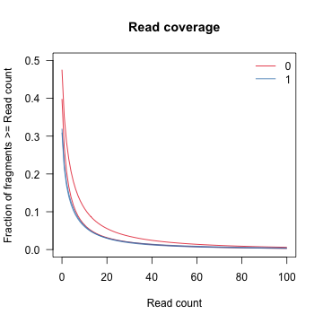

#### Fragment complexity

The *plotComplexity* function displays the number of distinct restriction fragments for each library, allowing the user to determine whether more sequencing is required. If the complexity curves do not approach saturation at full depth, then more sequencing is required to detect all restriction fragments in the library:

```r
# Plot fragment complexity
> plotComplexity(rawData, group = groupFactor)
```
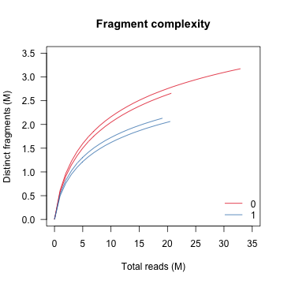

#### Sample enrichment

The *plotEnrichment* function displays a cumulative sum curve showing the fraction of reads aligned to all restriction fragments in the genome for each library, allowing the user to determine whether the Dam-fusion samples were sufficiently enriched so that they can be separated from the Dam background signal. If the area between the Dam-fusion and Dam curves is very small, this indicates that reads are equally distributed across the genome and that it might be hard to identify Dam-fusion over Dam enrichment:

```r
# Plot sample enrichment
> plotEnrichment(rawData, group = groupFactor)
```
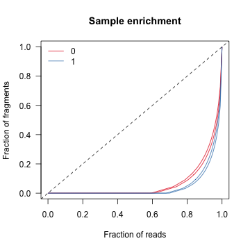

### Bias normalization

Daim implements a multi-step normalization procedure to remove restriction fragment biases and retain global differences in methylation between the Dam and Dam-fusion samples. Briefly, conditional quantile normalization (CQN) is applied to remove length and GC content biases, followed by a log2 per million transformation and smooth quantile normalization (SQN) to retain global differences in the statistical distribution. The *normalizeBias* function is used to transform the raw counts into bias-corrected log2 normalized abundance values:

```r
# Specify Dam and Dam-fusion groups
> groupFactor <- factor(c(0, 0, 1, 1), levels = c(0, 1))

# Normalize the raw DamID data
> normData <- normalizeBias(rawData, group = groupFactor)
```

The normalized data is returned within another RangedSummarizedExperiment object. The assays slot contains a matrix of bias-corrected log2 normalized abundance values for each library, and the colData slot contains an additional column with the group labels:

```r
# Container for normalized data
> normData
class: RangedSummarizedExperiment 
dim: 6669641 4 
metadata(0):
assays(1): qsmoothData
rownames: NULL
rowData names(8): digestBySize digestByProb ... baseMean1 log2FoldChange
colnames: NULL
colData names(2): bamPath groupFactor

# Normalized counts for each library
> assay(normData)
           [,1]      [,2]      [,3]      [,4]
 [1,] -3.788863 -5.134157 -4.704741 -5.457950
 [2,] -3.788863 -3.852287 -3.725150 -3.054048
 [3,] -3.788863 -3.852287 -3.725150 -3.754135
 [4,] -3.418098 -3.852287 -3.725150 -3.754135
 [5,] -3.788863 -3.852287 -3.725150 -2.202998
 [6,] -3.418098 -3.852287 -2.848567 -3.054048
 [7,] -3.788863 -3.852287 -3.725150 -3.754135
 [8,] -3.788863 -3.852287 -3.725150 -3.754135
 [9,] -3.788863 -3.852287 -3.725150 -3.754135
[10,] -4.037939 -3.852287 -3.725150 -3.754135

# Sample sheet for each library
> colData(normData)
DataFrame with 4 rows and 2 columns
      bamPath groupFactor
  <character>    <factor>
1    Dam1.bam           0
2    Dam2.bam           0
3 Fusion1.bam           1
4 Fusion2.bam           1
```

The rowData slot also also contains additional metadata columns used in downstream processing:

```r
# Show metadata columns
> rowData(normData)
DataFrame with 6669641 rows and 8 columns
        digestBySize         digestByProb filterBySize filterByExpr          baseMean         baseMean0         baseMean1     log2FoldChange
           <integer>            <numeric>    <logical>    <logical>         <numeric>         <numeric>         <numeric>          <numeric>
1            3000192 2.36651520969325e-05        FALSE        FALSE -4.77142787382212 -4.46150998720777 -5.08134576043647 -0.619835773228696
2                622    0.353697749196141         TRUE        FALSE -3.60508704795893 -3.82057502102196 -3.38959907489591  0.430975946126042
3                235    0.348936170212766         TRUE        FALSE -3.78010862429238 -3.82057502102196 -3.73964222756281 0.0809327934591422
4                 71    0.422535211267606        FALSE        FALSE -3.68741751518617 -3.63519280280954 -3.73964222756281 -0.104449424753277
5                676    0.371301775147929         TRUE        FALSE -3.39232434407198 -3.82057502102196   -2.964073667122  0.856501353899955
...              ...                  ...          ...          ...               ...               ...               ...                ...
6669637          517    0.481624758220503         TRUE        FALSE -3.04454625609229 -2.69949343728866 -3.38959907489591 -0.690105637607255
6669638          247    0.368421052631579         TRUE        FALSE -3.51239593885272 -3.63519280280954 -3.38959907489591  0.245593727913623
6669639          162    0.493827160493827         TRUE        FALSE -3.46013799026086  -3.1806337529589 -3.73964222756281 -0.559008474603915
6669640          199    0.376884422110553         TRUE        FALSE -1.56040607298282 -1.00191899969822 -2.11889314626743  -1.11697414656921
6669641       900002  1.1111086419808e-06        FALSE        FALSE -4.83369686718474 -4.58604797393302 -5.08134576043647 -0.495297786503451
```

The additional metadata columns include:

* filterBySize - Which fragments are too long (>1e6) or short (<100) to be retained for analysis.
* filterByExpr - Which fragments have sufficiently large counts (>10) to be retained for analysis.
* baseMean - The average fragment abundance across the Dam and Dam-fusion groups
* baseMean0 - The average fragment abundance for the Dam group
* baseMean1 - The average fragment abundance for the Dam-fusion group
* log2FoldChange - The log2 ratio of baseMean1 / baseMean0

### Genome coverage

Visualization of DamID-seq data can be done at the level of raw or normalised read coverage. The *writeAssay* function is used to generate genome coverage tracks in bigWig format of abundance values for individual samples:

```r
# Write Dam abundances
> writeAssay(normData, file = "Dam1.bigWig", sample = 1)
> writeAssay(normData, file = "Dam2.bigWig", sample = 2)

# Write Dam-fusion abundances
> writeAssay(normData, file = "Fusion1.bigWig", sample = 3)
> writeAssay(normData, file = "Fusion2.bigWig", sample = 4)
```
The *writeRatio* function can also be used to generate tracks of abundance ratios (Dam-fusion/Dam) between two contrasting samples:

```r
# Export Dam-fusion / Dam abundances
> writeRatio(normData, file = "Ratio1.bigWig", contrast = c(3, 1))
> writeRatio(normData, file = "Ratio2.bigWig", contrast = c(4, 2))
```

The bigWig files can then be visualised in a genome browser, such as IGV:

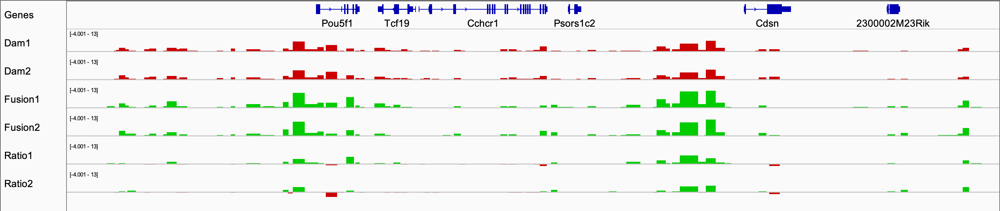

### Sample reproducibility

It is important to assess the affect of normalization on the DamID-seq data, usually by measuring reproducibility between replicates and seperation between sample groups.

#### Scatterplot correlation

The *plotCorrelation* function can be used to measure the linear correlation (using Spearman's rho) between two samples based on the normalized restriction fragment abundance values:

```r
# Dam1 vs Dam2
> plotCorrelation(normData, contrast = c(1, 2))

# Fusion1 vs Fusion2
> plotCorrelation(normData, contrast = c(3, 4))

# Dam1 vs Fusion1
> plotCorrelation(normData, contrast = c(1, 3))

# Dam2 vs Fusion2
> plotCorrelation(normData, contrast = c(2, 4))
```
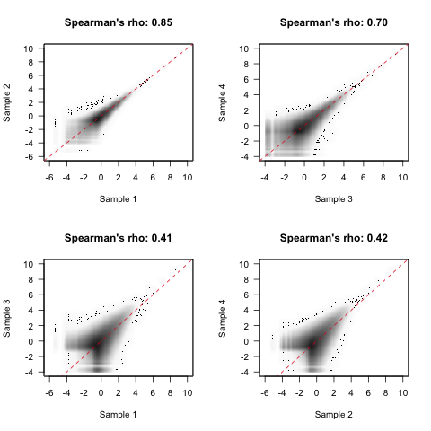

The Dam samples are often more correlated than Dam-fusion because chromatin accessibility appears to be more reproducible between independent samples than DNA binding. This is particulary true at lower cell numbers, where only a subset of binding is reproducible across all of the cells in a population. If the correlation between samples is low and you believe the cells to be fairly homogenous, additional libraries may be required in order to achieve any statistical significance in peak calling.

#### Mean difference

One issue with plotting one sample against the other is that the magnitude of any difference depends on the absolute abundance value. Instead, the *plotMA* function can be used to display the log2 difference between two samples over the average restriction fragment abundance. A loess regression model is also fit to the data to highlight deviations across the average abundance:

```r
# Dam1 vs Dam2
> plotMA(normData, contrast = c(1, 2))

# Fusion1 vs Fusion2
> plotMA(normData, contrast = c(3, 4))

# Dam1 vs Fusion1
> plotMA(normData, contrast = c(3, 1))

# Dam2 vs Fusion2
> plotMA(normData, contrast = c(4, 2))
```
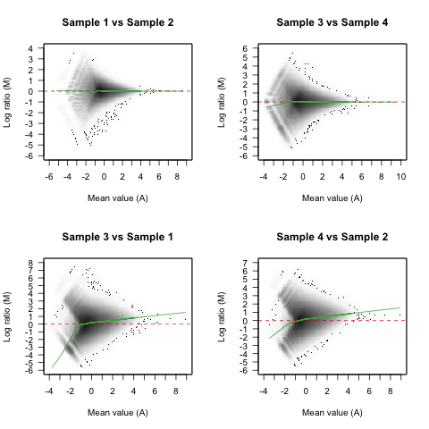

Differences amongst the Dam and Dam-fusion samples should decrease as fragment abundance increases due to biological variation overwhelming any technical variation. When compared against Dam samples, the Dam-fusion samples should exhibit a positive fold change at higher abundances where genuine DNA binding is predicted.

#### Abundance distribution

To visualise the effect of bias normalization, the distribution of raw and normalized abundance values should be inspected. The *plotDensity* function displays the distribution of abundance values for each sample, after removing fragments specified by the `filterBySize` and `filterByExpr` metadata columns:

```r
# Coloured by group
> plotDensity(normData, group = groupFactor)
```
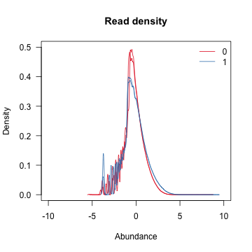

The Dam and Dam-fusion samples will exhibit globally different abundance profiles due to large differences in library composition. The normalization procedure implemented in Daim is designed to retain these differences which are due to targeting of the fusion protein to genuine DNA binding sites by the chromatin protein.

#### Principal components

Another way to assess overall similarity between samples is to visualise sample-to-sample distances using a principal component analysis (PCA). The *plotPCA* function generates a PCA plot from the normalized abundance values, after removing fragments specified by the `filterBySize` and `filterByExpr` metadata columns:

```r
# Coloured by group
> plotPCA(normData, group = groupFactor)
```
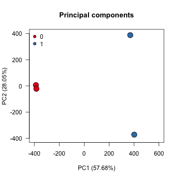

#### Multidimensional scaling

Sample-to-sample distances can also be visualised using multi-dimensional scaling (MDS). The *plotMDS* function generates a MDS plot from the normalized abundance values, after removing fragments specified by the `filterBySize` and `filterByExpr` metadata columns:

```r
# Coloured by group
> plotMDS(normData, group = groupFactor)
```
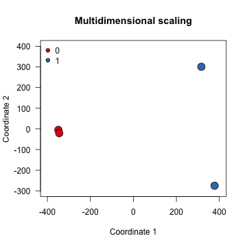

### Peak calling

Daim uses linear modelling and precision weights (provided by limma) to identify differentially methylated restriction fragments between the Dam and Dam-fusion samples. Notably, precision weights are estimated seperately for each group (i.e. different mean-variance curves) and a one-sided moderated t-test is used to identify differential methylation in one direction (i.e. log2 fold change above a threshold). Restriction fragments are then clustered into peak regions based upon the neighbouring distance and a combined P-value is calculated using Sime's method (provided by csaw). Finally, independent hypothesis weighting is used for multiple testing correction (provided by IHW) using the average restriction fragment abundance across the Dam and Dam-fusion groups. For more information about [limma](http://bioconductor.org/packages/release/bioc/html/limma.html), [csaw](https://bioconductor.org/packages/release/bioc/html/csaw.html), or [IHW](http://bioconductor.org/packages/release/bioc/html/IHW.html) please refer to the relevant package documentation.

#### DNA binding

The *callPeaks* function is used to identify DNA binding sites by testing for differentially methylated fragments (Dam-fusion/Dam) then clustering fragments into peak regions. The alpha parameter defines a significance cutoff and the lfc parameter specifies a log2 fold change threshold for each peak called:

```r
# Identify DNA binding sites
> bindSite <- callPeaks(normData, alpha = 0.05, lfc = log2(1.1))
```

The called peaks are represented as genomic ranges using the GRanges class. The object also contains a number of additional metadata columns which contain statistics for each peak region:

```r
# Container for peak regions
> bindSite
GRanges object with 49985 ranges and 6 metadata columns:
          seqnames            ranges strand |           baseMean           baseMean0          baseMean1    log2FoldChange                 pval                 padj
             <Rle>         <IRanges>  <Rle> |          <numeric>           <numeric>          <numeric>         <numeric>            <numeric>            <numeric>
      [1]     chr1   3058182-3058878      * | -0.171971778026624  -0.729953265260265  0.386009709207016  1.11596297446728   0.0156361204448793   0.0377156172207029
      [2]     chr1   3062430-3063077      * |   0.53524574813699  -0.183891572569733   1.25438306884371  1.43827464141345 0.000488440482804998  0.00367506643847225
      [3]     chr1   3150889-3153223      * |  0.225906790969608  -0.343100247811443  0.794913829750659   1.1380140775621 0.000584792752725416  0.00502775336278158
      [4]     chr1   3154291-3156059      * |  0.526688692390369 -0.0247433151819471   1.07812069996269  1.10286401514463  0.00549233993476922   0.0201307560357678
      [5]     chr1   3384264-3387202      * |     -1.40455023401   -2.30024761691275 -0.508852851107252  1.79139476580549  0.00499622417935201   0.0123957837965156
      ...      ...               ...    ... .                ...                 ...                ...               ...                  ...                  ...
  [49981]     chrY 90763184-90771549      * | -0.172190230388352  -0.755264014957346  0.410883554180642  1.16614756913799 5.79557220978728e-05   0.0007462992978076
  [49982]     chrY 90773271-90781418      * | -0.385432143019946  -0.860830775620523 0.0899664895806302 0.950797265201153 0.000443695717718682   0.0033589432198166
  [49983]     chrY 90782407-90808312      * |   1.67793755177809    1.26575663323503   2.09011847032116 0.824361837086134 5.01011088418489e-09 1.82964194497186e-06
  [49984]     chrY 90809315-90815233      * |   1.89199574149297    1.63193674991836   2.15205473306759 0.520117983149235 1.45726306559429e-05 0.000356180247283381
  [49985]     chrY 90823995-90828869      * | -0.276673501567332   -1.35280764260506  0.799460639470396  2.15226828207546 0.000861035724926579  0.00447527655754312
  -------
  seqinfo: 21 sequences from mm10 genome
```

The additional metadata columns include:

* baseMean - The average fragment abundance across the Dam and Dam-fusion groups
* baseMean0 - The average fragment abundance for the Dam group
* baseMean1 - The average fragment abundance for the Dam-fusion group
* log2FoldChange - The log2 ratio of baseMean1 / baseMean0
* pval - The probability this peak is observed by chance.
* padj - The IHW adjusted probability this peak is observed by chance.

After peak calling, the *writeBroad* function can be used to generate a broadPeak file containing the called peak regions:

```r
# Export DNA binding sites
> writeBroad(bindSite, file = "bindSite.broadPeak")
```

It is highly recommended that all broadPeak and bigWig files are imported into a genome browser for inspection. If multiple low enrichment peaks are found, try increasing the lfc threshold until these are removed. Peak calling is often an iterative process whereby peaks are refined based upon prior expectation, which in most cases is necessary for biological interpretation.

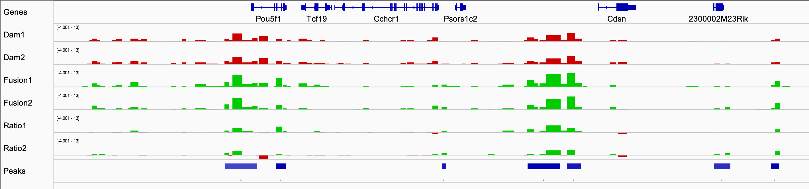

#### DNA accessibility

Chromatin accessibility can also be measured using DamID-seq data by calling peaks from the Dam replicates only. The Dam protein tends to diffuse throughout the cell and methylate accessible GATC sequences, which correlate with chromatin accessibility regions identified by ATAC-seq, DNase-seq, and FAIRE-seq data. The *computeInput* function is used to generate a simulated input for each Dam library, based upon the average restriction fragment abundance in neighbouring windows:

```r
# Generate input libraries
inputData <- computeInput(normData)
```

The *computeInput* function returns a RangedSummarizedExperiment object with the Dam-fusion libraries replaced with a corresponding input for each Dam library. The rowData and colData slots are also updated to accomodate the revised experimental design (Dam/Input) for differential methylation analysis:

```r
# Container for Dam and Input data
> inputData
class: RangedSummarizedExperiment 
dim: 6669641 4 
metadata(0):
assays(1): qsmoothData
rownames: NULL
rowData names(8): digestBySize digestByProb ... baseMean1 log2FoldChange
colnames: NULL
colData names(1): groupFactor

# Normalised counts for Dam and Input libraries
> assay(inputData)
           [,1]      [,2]      [,3]      [,4]
 [1,] -3.230601 -3.230601 -3.788863 -5.134157
 [2,] -3.230601 -3.230601 -3.788863 -3.852287
 [3,] -3.230601 -3.230601 -3.788863 -3.852287
 [4,] -3.230601 -3.230601 -3.418098 -3.852287
 [5,] -3.230601 -3.230601 -3.788863 -3.852287
 [6,] -3.230601 -3.230601 -3.418098 -3.852287
 [7,] -3.230601 -3.230601 -3.788863 -3.852287
 [8,] -3.230601 -3.230601 -3.788863 -3.852287
 [9,] -3.230601 -3.230601 -3.788863 -3.852287
[10,] -3.230601 -3.230601 -4.037939 -3.852287

# Sample sheet for Dam and Input libraries
> colData(inputData)
DataFrame with 4 rows and 1 column
  groupFactor
     <factor>
1           0
2           0
3           1
4           1
```

Genome coverage tracks for the Dam and Input libraries are generated using the *writeAssay* and *writeRatio* functions:

```r
# Export Input abundances
> writeAssay(inputData, "Input1.bigWig", sample = 1)
> writeAssay(inputData, "Input2.bigWig", sample = 2)
```

The *callPeaks* function can now be used to identify chromatin accessibility sites by testing for differentially methylated fragments (Dam/Input) then clustering fragments into peak regions. Again, the alpha parameter defines a significance cutoff and the lfc parameter specifies a log2 fold change threshold for each peak called:

```r
# Identify DNA accessibility sites
> openSite <- callPeaks(inputData, alpha = 0.05, lfc = log2(1.2))
```

The *callPeaks* function again returns a GRanges object of peak calls, alongside the usual metadata columns:

```r
# Container for peak regions
> openSite
GRanges object with 152591 ranges and 6 metadata columns:
           seqnames            ranges strand |           baseMean          baseMean0          baseMean1      log2FoldChange                 pval                 padj
              <Rle>         <IRanges>  <Rle> |          <numeric>          <numeric>          <numeric>           <numeric>            <numeric>            <numeric>
       [1]     chr1   3054693-3056136      * | -0.833907398509269 -0.836950353742608  -0.83086444327593 0.00608591046667772  0.00151010159256219  0.00197102261923317
       [2]     chr1   3058182-3058878      * | -0.171971778026624 -0.729953265260265  0.386009709207016    1.11596297446728 0.000890858702088453  0.00305929727987039
       [3]     chr1   3062430-3063077      * |   0.53524574813699 -0.183891572569733   1.25438306884371    1.43827464141345 8.80636430795526e-05 0.000706906004736748
       [4]     chr1   3073624-3074712      * | -0.613594922196488 -0.542362275549609 -0.684827568843366  -0.142465293293757 6.83331019921134e-05 0.000290124776431813
       [5]     chr1   3150889-3153223      * |  0.225906790969608 -0.343100247811443  0.794913829750659     1.1380140775621 0.000679632510242536  0.00305770550331489
       ...      ...               ...    ... .                ...                ...                ...                 ...                  ...                  ...
  [152587]     chrY 90791959-90792324      * |    1.9661018715055   1.46948301297028   2.46272073004072   0.993237717070437 1.20077500842484e-05 0.000489456880485241
  [152588]     chrY 90794947-90815233      * |   2.39938349925504   2.25663101362431   2.54213598488576   0.285504971261447 1.32115114227678e-06 0.000143375211202084
  [152589]     chrY 90823995-90828869      * | -0.276673501567332  -1.35280764260506  0.799460639470396    2.15226828207546  0.00706164240790807   0.0133899178739411
  [152590]     chrY 90830303-90833882      * |  -0.47794173783714 -0.769318721027246 -0.186564754647035   0.582753966380211  0.00144443626793504   0.0026572663116779
  [152591]     chrY 90835726-90840316      * | -0.481045722927229 -0.722417291984777 -0.239674153869682   0.482743138115095 0.000135851264405087 0.000510725915204624
  -------
  seqinfo: 21 sequences from mm10 genome
```

Again, the *writeBroad* function can be used to generate broadPeak files containing the called peak regions:

```r
# Export DNA accessibility sites
> writeBroad(openSite, file = "openSite.broadPeak")
```

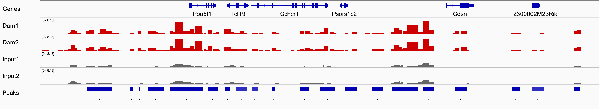

### Downstream analyses

Once a set of confident peak regions has been determined, the user can then perform a number of donwstream analyses to explore the biological function of the chromatin protein being studied.

#### Functional analysis

The *annotatePeaks* function can be used to assign each peak to its closest gene TSS and genomic region:

```r
# Annotate peak calls
> bindSite <- annotatePeaks(bindSite, genome = "mm10")
```
The original GRanges object is returned with additional metadata columns:

```r
# Show metadata columns
> bindSite
GRanges object with 49985 ranges and 12 metadata columns:
          seqnames            ranges strand |           baseMean           baseMean0          baseMean1    log2FoldChange                 pval                 padj          entrezTSS   symbolTSS distanceTSS genomicFeature
             <Rle>         <IRanges>  <Rle> |          <numeric>           <numeric>          <numeric>         <numeric>            <numeric>            <numeric>        <character> <character>   <integer>    <character>
      [1]     chr1   3058182-3058878      * | -0.171971778026624  -0.729953265260265  0.386009709207016  1.11596297446728   0.0156361204448793   0.0377156172207029 ENSMUSG00000090025        <NA>        2949     Intergenic
      [2]     chr1   3062430-3063077      * |   0.53524574813699  -0.183891572569733   1.25438306884371  1.43827464141345 0.000488440482804998  0.00367506643847225 ENSMUSG00000090025        <NA>        7197     Intergenic
      [3]     chr1   3150889-3153223      * |  0.225906790969608  -0.343100247811443  0.794913829750659   1.1380140775621 0.000584792752725416  0.00502775336278158 ENSMUSG00000064842        <NA>       47873     Intergenic
      [4]     chr1   3154291-3156059      * |  0.526688692390369 -0.0247433151819471   1.07812069996269  1.10286401514463  0.00549233993476922   0.0201307560357678 ENSMUSG00000064842        <NA>       51275     Intergenic
      [5]     chr1   3384264-3387202      * |     -1.40455023401   -2.30024761691275 -0.508852851107252  1.79139476580549  0.00499622417935201   0.0123957837965156 ENSMUSG00000089699        <NA>      -79284         Intron
      ...      ...               ...    ... .                ...                 ...                ...               ...                  ...                  ...                ...         ...         ...            ...
  [49981]     chrY 90763184-90771549      * | -0.172190230388352  -0.755264014957346  0.410883554180642  1.16614756913799 5.79557220978728e-05   0.0007462992978076 ENSMUSG00000095134        <NA>        6527     Intergenic
  [49982]     chrY 90773271-90781418      * | -0.385432143019946  -0.860830775620523 0.0899664895806302 0.950797265201153 0.000443695717718682   0.0033589432198166 ENSMUSG00000096768       Erdr1       -3219     Intergenic
  [49983]     chrY 90782407-90808312      * |   1.67793755177809    1.26575663323503   2.09011847032116 0.824361837086134 5.01011088418489e-09 1.82964194497186e-06 ENSMUSG00000096768       Erdr1           0         Intron
  [49984]     chrY 90809315-90815233      * |   1.89199574149297    1.63193674991836   2.15205473306759 0.520117983149235 1.45726306559429e-05 0.000356180247283381 ENSMUSG00000096768       Erdr1       22729         Intron
  [49985]     chrY 90823995-90828869      * | -0.276673501567332   -1.35280764260506  0.799460639470396  2.15226828207546 0.000861035724926579  0.00447527655754312 ENSMUSG00000096850        <NA>        9308     Intergenic
  -------
  seqinfo: 21 sequences from mm10 genome
```

The metadata columns include:

* entrezTSS - Entrez identifier for TSS
* symbolTSS - Gene symbol for TSS
* distanceTSS - Distance from peak to TSS
* genomicRegion - Genomic annotation (TSS, TES, Exon, UTR5, UTR3, Intron, Intergenic)

A number of plotting functions can then be used to explore the distribution of peaks within the genome:

```r
# Binned by absolute distance to TSS
> plotTSS(bindSite, dist = "absolute")
```
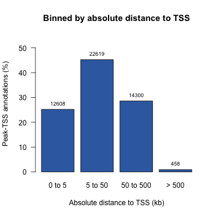

```r
# Binned by relative distance to TSS
> plotTSS(bindSite, dist = "relative")
```
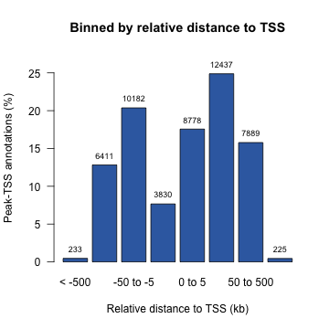

```r
# Binned by genomic feature
plotFeature(bindSite)
````
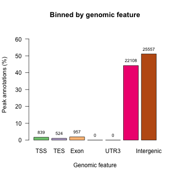

#### Sequence analysis

The peaks identified from DamID-seq data tend to be large (>1Kb) and the motif is often not centrally enriched. This limits the application of motif analysis tools which traditionally require short sequences (~500bp) centered on the motif, such as in ChIP-seq data. To overcome this problem, Daim implements a known motif search using position weight matrices (PWM) to identify regions within the peak which contain the expected binding motif. The *searchMotif* function is used to search peak regions for medium-high scoring matches (>50% of maximum theoretical score) to the PWM used: 

```r
# Import PWM data from JASPAR
> motifPWM <- as.matrix(read.table("MA0142.1.pfm", skip = 1))
> rownames(motifPWM) <- c("A", "C", "G", "T")

# Search for the MA0142.1 motif
> bindSite <- searchMotif(BSgenome.Mmusculus.UCSC.mm10, ranges = bindSite, matrix = motifPWM)
```
If any high scoring matches are found, two additional metadata columns are appended to the GRanges object:

```r
# Show metadata columns
> bindSite
GRanges object with 49985 ranges and 12 metadata columns:
          seqnames            ranges strand |           baseMean           baseMean0          baseMean1    log2FoldChange                 pval                 padj          entrezTSS   symbolTSS distanceTSS genomicFeature motifCenter motifScore
             <Rle>         <IRanges>  <Rle> |          <numeric>           <numeric>          <numeric>         <numeric>            <numeric>            <numeric>        <character> <character>   <integer>    <character>   <numeric>  <numeric>
      [1]     chr1   3058182-3058878      * | -0.171971778026624  -0.729953265260265  0.386009709207016  1.11596297446728   0.0156361204448793   0.0377156172207029 ENSMUSG00000090025        <NA>        2949     Intergenic     3058738      10688
      [2]     chr1   3062430-3063077      * |   0.53524574813699  -0.183891572569733   1.25438306884371  1.43827464141345 0.000488440482804998  0.00367506643847225 ENSMUSG00000090025        <NA>        7197     Intergenic     3062938      10332
      [3]     chr1   3150889-3153223      * |  0.225906790969608  -0.343100247811443  0.794913829750659   1.1380140775621 0.000584792752725416  0.00502775336278158 ENSMUSG00000064842        <NA>       47873     Intergenic     3152643      12871
      [4]     chr1   3154291-3156059      * |  0.526688692390369 -0.0247433151819471   1.07812069996269  1.10286401514463  0.00549233993476922   0.0201307560357678 ENSMUSG00000064842        <NA>       51275     Intergenic     3155845      10649
      [5]     chr1   3384264-3387202      * |     -1.40455023401   -2.30024761691275 -0.508852851107252  1.79139476580549  0.00499622417935201   0.0123957837965156 ENSMUSG00000089699        <NA>      -79284         Intron     3385461      11683
      ...      ...               ...    ... .                ...                 ...                ...               ...                  ...                  ...                ...         ...         ...            ...         ...        ...
  [49981]     chrY 90763184-90771549      * | -0.172190230388352  -0.755264014957346  0.410883554180642  1.16614756913799 5.79557220978728e-05   0.0007462992978076 ENSMUSG00000095134        <NA>        6527     Intergenic    90764284      11465
  [49982]     chrY 90773271-90781418      * | -0.385432143019946  -0.860830775620523 0.0899664895806302 0.950797265201153 0.000443695717718682   0.0033589432198166 ENSMUSG00000096768       Erdr1       -3219     Intergenic    90780511      11050
  [49983]     chrY 90782407-90808312      * |   1.67793755177809    1.26575663323503   2.09011847032116 0.824361837086134 5.01011088418489e-09 1.82964194497186e-06 ENSMUSG00000096768       Erdr1           0         Intron    90794725      11799
  [49984]     chrY 90809315-90815233      * |   1.89199574149297    1.63193674991836   2.15205473306759 0.520117983149235 1.45726306559429e-05 0.000356180247283381 ENSMUSG00000096768       Erdr1       22729         Intron    90809837      11989
  [49985]     chrY 90823995-90828869      * | -0.276673501567332   -1.35280764260506  0.799460639470396  2.15226828207546 0.000861035724926579  0.00447527655754312 ENSMUSG00000096850        <NA>        9308     Intergenic    90825611      10238
  -------
  seqinfo: 21 sequences from mm10 genome
```
The metadata columns include:

* motifCenter - The distance from the start of the peak to the centre of the motif
* motifScore - The calculated PWM score

To increase the resolution of peaks identified from DamID-seq data, the peak regions can then be centred according to the position of the motif and resized to a constant width:

```r
bindSite <- centerMotif(bindSite, size = 500)
```

A GRanges object with the centered and resized genomic ranges is returned.

```r
# Show resized peaks
> bindSite
GRanges object with 49985 ranges and 12 metadata columns:
          seqnames            ranges strand |           baseMean           baseMean0          baseMean1    log2FoldChange                 pval                 padj          entrezTSS   symbolTSS distanceTSS genomicFeature motifCenter motifScore
             <Rle>         <IRanges>  <Rle> |          <numeric>           <numeric>          <numeric>         <numeric>            <numeric>            <numeric>        <character> <character>   <integer>    <character>   <numeric>  <numeric>
      [1]     chr1   3058738-3059237      * | -0.171971778026624  -0.729953265260265  0.386009709207016  1.11596297446728   0.0156361204448793   0.0377156172207029 ENSMUSG00000090025        <NA>        2949     Intergenic     3058738      10688
      [2]     chr1   3062938-3063437      * |   0.53524574813699  -0.183891572569733   1.25438306884371  1.43827464141345 0.000488440482804998  0.00367506643847225 ENSMUSG00000090025        <NA>        7197     Intergenic     3062938      10332
      [3]     chr1   3152643-3153142      * |  0.225906790969608  -0.343100247811443  0.794913829750659   1.1380140775621 0.000584792752725416  0.00502775336278158 ENSMUSG00000064842        <NA>       47873     Intergenic     3152643      12871
      [4]     chr1   3155845-3156344      * |  0.526688692390369 -0.0247433151819471   1.07812069996269  1.10286401514463  0.00549233993476922   0.0201307560357678 ENSMUSG00000064842        <NA>       51275     Intergenic     3155845      10649
      [5]     chr1   3385461-3385960      * |     -1.40455023401   -2.30024761691275 -0.508852851107252  1.79139476580549  0.00499622417935201   0.0123957837965156 ENSMUSG00000089699        <NA>      -79284         Intron     3385461      11683
      ...      ...               ...    ... .                ...                 ...                ...               ...                  ...                  ...                ...         ...         ...            ...         ...        ...
  [49981]     chrY 90764284-90764783      * | -0.172190230388352  -0.755264014957346  0.410883554180642  1.16614756913799 5.79557220978728e-05   0.0007462992978076 ENSMUSG00000095134        <NA>        6527     Intergenic    90764284      11465
  [49982]     chrY 90780511-90781010      * | -0.385432143019946  -0.860830775620523 0.0899664895806302 0.950797265201153 0.000443695717718682   0.0033589432198166 ENSMUSG00000096768       Erdr1       -3219     Intergenic    90780511      11050
  [49983]     chrY 90794725-90795224      * |   1.67793755177809    1.26575663323503   2.09011847032116 0.824361837086134 5.01011088418489e-09 1.82964194497186e-06 ENSMUSG00000096768       Erdr1           0         Intron    90794725      11799
  [49984]     chrY 90809837-90810336      * |   1.89199574149297    1.63193674991836   2.15205473306759 0.520117983149235 1.45726306559429e-05 0.000356180247283381 ENSMUSG00000096768       Erdr1       22729         Intron    90809837      11989
  [49985]     chrY 90825611-90826110      * | -0.276673501567332   -1.35280764260506  0.799460639470396  2.15226828207546 0.000861035724926579  0.00447527655754312 ENSMUSG00000096850        <NA>        9308     Intergenic    90825611      10238
  -------
  seqinfo: 21 sequences from mm10 genome
```

After centering the peak regions and resizing to a constant width, conventional motif analysis tools can be used and in most cases de-novo motif discovery will perform much better given the assumptions are more closely matched.

## Contributing

To contribute to Daim, clone this repository locally and commit your code on a separate branch. Participation in this open source project is subject to a [Code of Conduct](CODE_OF_CONDUCT.md).

## Support and Migration

Currently there is only one major version of Daim released. When the next major version becomes available, this section will help existing users with the migration.

## News

To review all notable changes to the Daim package, read the [NEWS](NEWS.md) file either in this repository or in R using the following command:

```r
news("Daim")
```

## Thanks

I would like to thank all of the contributors on the [Bioconductor Support](https://support.bioconductor.org/) and [Biostars](https://www.biostars.org/) forums for their help and patience with my questions. In particular, [Aaron Lun](https://support.bioconductor.org/u/6732/) and [Hervé Pagès](https://support.bioconductor.org/u/1542/) in regards to statistical and technical problems. I would also like to thank [Martin Morgan](https://www.roswellpark.org/martin-morgan) and the [Bioconductor consortium](https://www.bioconductor.org/about/core-team/) for sponsoring my travel to the Bioconductor conference in 2017 where I learned a lot about package development and got the opportunity to present my work to other developers. Finally, I would like to thank [Rowan Manning](https://github.com/rowanmanning) for providing simple and effective guidelines for [writing a friendly README](https://rowanmanning.com/posts/writing-a-friendly-readme/). 

## Citation

If you use Daim in your research, please cite the following article:

[Luca Tosti, James Ashmore, Boon Siang Nicholas Tan, Benedetta Carbone, Tapan K. Mistri, Valerie Wilson, Simon R. Tomlinson and Keisuke Kaji (2018). Mapping transcription factor occupancy using minimal numbers of cells in vitro and in vivo. Genome Research, 28, 592-605. doi: 10.1101/gr.227124.117](https://genome.cshlp.org/content/28/4/592)

## References

1. https://emea.illumina.com/science/sequencing-method-explorer/kits-and-arrays/damid.html

## License

Daim is licensed under the [MIT](#) license.  
Copyright &copy; 2018, James Ashmore
